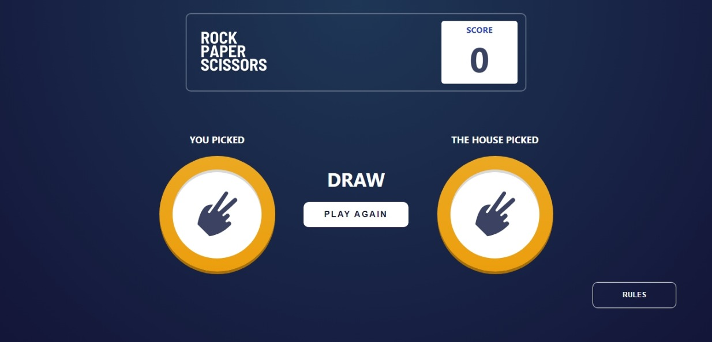

# Frontend Mentor - Rock, Paper, Scissors solution

This is a solution to the [Rock, Paper, Scissors challenge on Frontend Mentor](https://www.frontendmentor.io/challenges/rock-paper-scissors-game-pTgwgvgH). Frontend Mentor challenges help you improve your coding skills by building realistic projects. 

## Table of contents
- [Frontend Mentor - Rock, Paper, Scissors solution](#frontend-mentor---rock-paper-scissors-solution)
  - [Table of contents](#table-of-contents)
  - [Overview](#overview)
    - [Screenshot](#screenshot)
    - [The challenge](#the-challenge)
    - [Links](#links)
  - [Process](#process)
    - [Tools Used](#tools-used)
  - [Author](#author)
  - [Acknowledgement](#acknowledgement)

## Overview
### Screenshot

### The challenge

Users should be able to:

- View the optimal layout for the game depending on their device's screen size
- Play Rock, Paper, Scissors against the computer

### Links
- [Github repository](https://github.com/Emmanuel-Afrifa/advanced-rock-paper-scissor)
- [Deployed site](https://newsletter-sign-up-sol.netlify.app/)

## Process
### Tools Used
- Semantic HTML5 markup
- CSS
- Flexbox
- Grid
- Mobile-first workflow
- [React](https://reactjs.org/) - JS library

## Author
- Emmanuel Afrifa
- [emmaquame9@gmail.com](mailto:emmaquame9@gmail.com)
- [Frontend-Mentor](https://www.frontendmentor.io/profile/Emmanuel-Afrifa)
- [Twitter](https://twitter.com/Emma33712365)
- [Linkedin](https://www.linkedin.com/in/emmanuel-afrifa-840674214/)

## Acknowledgement
- [Frontend Mentor](https://www.frontendmentor.io/)
- [FreeCodeCamp Responsive Web Design](https://www.freecodecamp.org/learn/responsive-web-design/)
